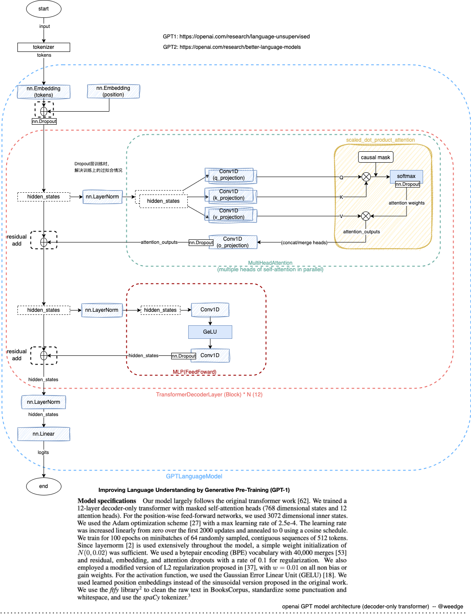

# Model
0. [**GPT1: Improving Language Understanding by Generative Pre-Training**](https://s3-us-west-2.amazonaws.com/openai-assets/research-covers/language-unsupervised/language_understanding_paper.pdf) | https://openai.com/research/language-unsupervised 
1. [**GPT2: Language Models are Unsupervised Multitask Learners**](https://openai.com/research/better-language-models) | https://openai.com/research/better-language-models 
2. [openai-gpt-train.py](https://github.com/openai/finetune-transformer-lm/blob/master/train.py) | [openai-gpt2-model.py](https://github.com/openai/gpt-2/blob/master/src/model.py) (gpt2 使用TensorFlow定义了模型，但没有训练代码)
3. [HF-transformer-openai-gpt](https://huggingface.co/docs/transformers/model_doc/openai-gpt) | [HF-transformer-gpt2](https://huggingface.co/docs/transformers/model_doc/gpt2)
4. [openai/image-gpt](https://github.com/openai/image-gpt) 在其代码中有一些更现代化的类似gpt-3的修改，也是一个很好的参考
   
## Paper

### [Improving Language Understanding by Generative Pre-Training](https://openai.com/research/language-unsupervised) (GPT-1)

- 我们的模型主要遵循了最初的Transformer工作
- 我们训练了一个仅包含12层解码器的Transformer，具有掩码的自注意力头（768维状态和12个注意力头）。对于位置感知的前馈网络，我们使用了3072维的内部状态。
- Adam最大学习率为2.5e-4（后来GPT-3对于这个模型大小使用了6e-4）
- 学习率衰减：在前2000个更新期间线性增加到零，然后使用余弦调度退火到0
- 我们对64个随机抽样的连续512个标记序列的小批次进行了100个时期的训练。
- 由于层归一化在整个模型中被广泛使用，简单的N（0，0.02）权重初始化就足够了
- 使用了具有40,000个合并的字节对编码（BPE）词汇表
- 为了正则化，采用了残差、嵌入和注意力的丢弃率为0.1。
- 修改了文献(37)中提出的L2正则化的版本，对所有非偏置或增益权重设置了w = 0.01
- 作为激活函数，我们使用了高斯误差线性单元（GELU）。
- 我们使用了学习的位置嵌入，而不是原始工作中提出的正弦版本
- 对于微调：我们向分类器添加了0.1的丢弃率。学习率为6.25e-5，批量大小为32。3个时期。我们使用线性学习率衰减计划，并在训练的0.2%上进行预热。λ设置为0.5。
- GPT-1模型有12层和d_model 768，约117M个参数。

### [Language Models are Unsupervised Multitask Learners](https://openai.com/research/better-language-models) (GPT-2)

- LayerNorm被移到了每个子块的输入处，类似于预激活残差网络
- 在最终的自注意力块之后添加了额外的层归一化。
- 使用考虑到模型深度上残差路径累积的修改初始化。我们在初始化时通过1/√N的因子缩放残差层的权重，其中N是残差层的数量。（奇怪的是，因为在他们的发布的代码中我只能找到对旧的0.02的简单使用...在他们发布的image-gpt代码中我发现它被用于c_proj，即使仅用于attn，而不用于mlp。嗯。[链接](https://github.com/openai/image-gpt/blob/master/src/model.py)）
- 词汇表扩展到50,257
- 上下文大小从512标记增加到1024标记
- 使用更大的批量大小512
- GPT-2使用48层和d_model 1600（与原始的12层和d_model 768相比）。约1.542B参数

### [Language Models are Few-Shot Learners](https://arxiv.org/abs/2005.14165) (GPT-3) 

- GPT-3：96层，96个头，d_model为12,288（175B参数）。
- 类似GPT-1：12层，12个头，d_model 768（125M）
- 我们使用与GPT-2相同的模型和架构，包括其中描述的修改初始化、预归一化和可逆标记化
- 在Transformer的层中，我们使用交替的密集和局部带状的稀疏注意力模式，类似于Sparse Transformer
- 我们始终使前馈层的大小是瓶颈层的四倍，dff = 4 ∗ dmodel
- 所有模型使用nctx = 2048标记的上下文窗口。
- Adam的β1 = 0.9，β2 = 0.95，eps = 10^(-8)
- 所有模型都使用0.1的权重衰减提供少量正则化。（注意：GPT-1使用了0.01，见上文）
- 将梯度的全局范数剪切为1.0
- 线性学习率在前3.75亿个标记上进行预热。然后使用余弦衰减，使学习率下降到其值的10%，在2600亿个标记上进行。
- 从小值（32k标记）线性逐渐增加批量大小到完整值，在前4-12亿个标记的训练中取决于模型大小。
- 始终使用完整的2048大小的时间上下文窗口，其中包含特殊的DOCUMENT结束标记。
- 数据集大部分来自Common Crawl，通过GPT2采集的正向数据webtext, 进行过滤；通过LSH(Spark’s MinHashLSH)过滤相似度高的数据

### [Generative Pretraining from Pixels](https://cdn.openai.com/papers/Generative_Pretraining_from_Pixels_V2.pdf) (Image GPT)

- 在处理图像时，我们选择标识排列πi = i，其中1 ≤ i ≤ n，也称为光栅顺序。
- 我们通过使用k = 512的k均值聚类（R、G、B）像素值来创建自己的9位颜色调色板。
- 我们最大的模型iGPT-XL 包含L = 60层，使用嵌入大小d = 3072，总共有68亿参数。
- 我们的次大模型iGPT-L 与GPT-2基本相同，具有L = 48层，但包含略小的嵌入大小d = 1536（与1600相比），总共有14亿参数。
- 我们使用与GPT-2相同的模型代码，不同之处在于我们按照Sparse Transformer (Child等，2019)的方式以层为单位初始化权重，并将产生logits的所有投影都初始化为零。
- 我们还训练了iGPT-M，一个455M参数的模型，具有L = 36和d = 1024
- iGPT-S，一个76M参数的模型，具有L = 24和d = 512（好的，还有多少个头？看起来GitHub代码声称是8）
- 在对iGPT-XL进行预训练时，我们使用批量大小为64进行2M次迭代训练，对于所有其他模型，我们使用批量大小为128进行1M次迭代训练。
- Adam的β1 = 0.9和β2 = 0.95
- 学习率在一个epoch进行预热，然后衰减至0
- 我们没有使用权重衰减，因为应用小的权重衰减0.01并没有改变表示质量。
- iGPT-S学习率为0.003
- 不使用dropout。


### other resources
- [InstructGPT: Aligning language models to follow instructions](https://openai.com/research/instruction-following)
- [ChatGPT](https://openai.com/blog/chatgpt) | [Proximal Policy Optimization Algorithms](https://openai.com/research/openai-baselines-ppo)
- [GPT-4 Technical Report](https://openai.com/research/gpt-4)

## Model-Architecture

- gpt2: dict(n_layer=12, n_head=12, n_embd=768),  # 124M params
```python
from transformers import AutoModelForCausalLM
from transformers import GPT2LMHeadModel
from torch import nn

def print_hf_gpt2_model(model_path):
    hf_model = GPT2LMHeadModel.from_pretrained(model_path)
    print(hf_model)
    hf_dict = hf_model.state_dict()
    print(hf_model.config)
    #print(hf_dict.keys())

model_path = "gpt2"
print_hf_gpt2_model(model_path)
```

```
GPT2LMHeadModel(
  (transformer): GPT2Model(
    (wte): Embedding(50257, 768)
    (wpe): Embedding(1024, 768)
    (drop): Dropout(p=0.1, inplace=False)
    (h): ModuleList(
      (0-11): 12 x GPT2Block(
        (ln_1): LayerNorm((768,), eps=1e-05, elementwise_affine=True)
        (attn): GPT2Attention(
          (c_attn): Conv1D()
          (c_proj): Conv1D()
          (attn_dropout): Dropout(p=0.1, inplace=False)
          (resid_dropout): Dropout(p=0.1, inplace=False)
        )
        (ln_2): LayerNorm((768,), eps=1e-05, elementwise_affine=True)
        (mlp): GPT2MLP(
          (c_fc): Conv1D()
          (c_proj): Conv1D()
          (act): NewGELUActivation()
          (dropout): Dropout(p=0.1, inplace=False)
        )
      )
    )
    (ln_f): LayerNorm((768,), eps=1e-05, elementwise_affine=True)
  )
  (lm_head): Linear(in_features=768, out_features=50257, bias=False)
)
GPT2Config {
  "_name_or_path": "gpt2",
  "activation_function": "gelu_new",
  "architectures": [
    "GPT2LMHeadModel"
  ],
  "attn_pdrop": 0.1,
  "bos_token_id": 50256,
  "embd_pdrop": 0.1,
  "eos_token_id": 50256,
  "initializer_range": 0.02,
  "layer_norm_epsilon": 1e-05,
  "model_type": "gpt2",
  "n_ctx": 1024,
  "n_embd": 768,
  "n_head": 12,
  "n_inner": null,
  "n_layer": 12,
  "n_positions": 1024,
  "reorder_and_upcast_attn": false,
  "resid_pdrop": 0.1,
  "scale_attn_by_inverse_layer_idx": false,
  "scale_attn_weights": true,
  "summary_activation": null,
  "summary_first_dropout": 0.1,
  "summary_proj_to_labels": true,
  "summary_type": "cls_index",
  "summary_use_proj": true,
  "task_specific_params": {
    "text-generation": {
      "do_sample": true,
      "max_length": 50
    }
  },
  "transformers_version": "4.35.2",
  "use_cache": true,
  "vocab_size": 50257
}

```
- gpt2-medium:  dict(n_layer=24, n_head=16, n_embd=1024), # 350M params
- gpt2-large:   dict(n_layer=36, n_head=20, n_embd=1280), # 774M params
- gpt2-xl:      dict(n_layer=48, n_head=25, n_embd=1600), # 1558M params




# 笔记：
- [**nanoGPT**](https://colab.research.google.com/drive/1pY8-ql-koaE2fUTB3zRqQQ9pWkPT0bCs?usp=sharing)


# 参考：
1. https://jalammar.github.io/illustrated-word2vec/
2. https://jalammar.github.io/visualizing-neural-machine-translation-mechanics-of-seq2seq-models-with-attention/
3. https://jalammar.github.io/illustrated-transformer/
4. https://colab.research.google.com/github/kmkarakaya/ML_tutorials/blob/master/Conv1d_Predict_house_prices.ipynb
5. https://jalammar.github.io/illustrated-gpt2/
7. [GPT，GPT-2，GPT-3 论文精读](https://www.youtube.com/watch?v=t70Bl3w7bxY)