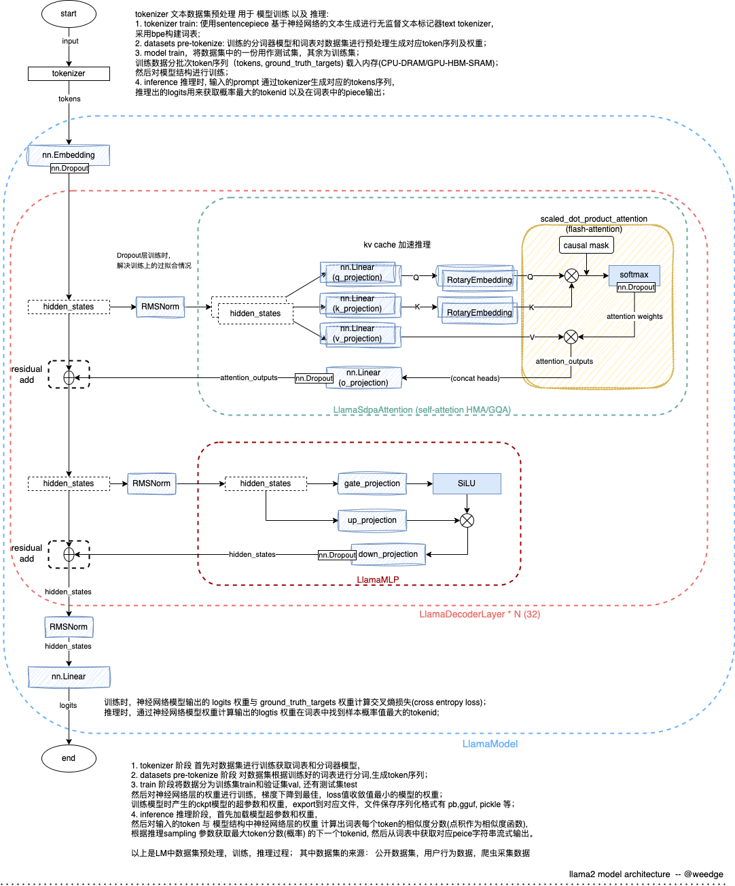

# Model

1. [**Llama 2: Open Foundation and Fine-Tuned Chat Models**](https://arxiv.org/abs/2307.09288)
2. [meta-llam2-model.py](https://github.com/facebookresearch/llama/blob/main/llama/model.py)
3. [HF-transformer-llama2](https://huggingface.co/docs/transformers/model_doc/llama2)
   
## Model-Architecture

```python
from transformers import AutoModelForCausalLM
from torch import nn

def print_hf_llama2_model(model_path):
    # load HF pretrained llama2 model
    hf_model = AutoModelForCausalLM.from_pretrained(model_path,device_map='auto')
    print(hf_model)
    hf_dict = hf_model.state_dict()
    print(hf_model.config)

    for i in range(0,hf_model.config.num_hidden_layers):
        print(f"model.layers.{i}.input_layernorm.weight => {hf_dict[f'model.layers.{i}.input_layernorm.weight'].shape}")
        print(f"model.layers.{i}.self_attn.q_proj.weight => {hf_dict[f'model.layers.{i}.self_attn.q_proj.weight'].shape}")
        print(f"model.layers.{i}.self_attn.k_proj.weight => {hf_dict[f'model.layers.{i}.self_attn.k_proj.weight'].shape}")
        print(f"model.layers.{i}.self_attn.k_proj.weight => {hf_dict[f'model.layers.{i}.self_attn.v_proj.weight'].shape}")
        print(f"model.layers.{i}.self_attn.k_proj.weight => {hf_dict[f'model.layers.{i}.self_attn.o_proj.weight'].shape}")
        print(f"model.layers.{i}.post_attention_layernorm.weight => {hf_dict[f'model.layers.{i}.post_attention_layernorm.weight'].shape}")
        print(f"model.layers.{i}.mlp.gate_proj.weight => {hf_dict[f'model.layers.{i}.mlp.gate_proj.weight'].shape}")
        print(f"model.layers.{i}.mlp.down_proj.weight => {hf_dict[f'model.layers.{i}.mlp.down_proj.weight'].shape}")
        print(f"model.layers.{i}.mlp.up_proj.weight => {hf_dict[f'model.layers.{i}.mlp.up_proj.weight'].shape}")

    # final classifier
    print(f"lm_head.weight => {hf_dict['lm_head.weight'].shape}")

```

- **7B**
``` python
model_path = "meta-llama/Llama-2-7b-hf"
print_hf_llama2_model(model_path)
```
```
LlamaForCausalLM(
  (model): LlamaModel(
    (embed_tokens): Embedding(32000, 4096)
    (layers): ModuleList(
      (0-31): 32 x LlamaDecoderLayer(
        (self_attn): LlamaSdpaAttention(
          (q_proj): Linear(in_features=4096, out_features=4096, bias=False)
          (k_proj): Linear(in_features=4096, out_features=4096, bias=False)
          (v_proj): Linear(in_features=4096, out_features=4096, bias=False)
          (o_proj): Linear(in_features=4096, out_features=4096, bias=False)
          (rotary_emb): LlamaRotaryEmbedding()
        )
        (mlp): LlamaMLP(
          (gate_proj): Linear(in_features=4096, out_features=11008, bias=False)
          (up_proj): Linear(in_features=4096, out_features=11008, bias=False)
          (down_proj): Linear(in_features=11008, out_features=4096, bias=False)
          (act_fn): SiLU()
        )
        (input_layernorm): LlamaRMSNorm()
        (post_attention_layernorm): LlamaRMSNorm()
      )
    )
    (norm): LlamaRMSNorm()
  )
  (lm_head): Linear(in_features=4096, out_features=32000, bias=False)
)
LlamaConfig {
  "_name_or_path": "meta-llama/Llama-2-7b-hf",
  "architectures": [
    "LlamaForCausalLM"
  ],
  "attention_bias": false,
  "attention_dropout": 0.0,
  "bos_token_id": 1,
  "eos_token_id": 2,
  "hidden_act": "silu",
  "hidden_size": 4096,
  "initializer_range": 0.02,
  "intermediate_size": 11008,
  "max_position_embeddings": 4096,
  "model_type": "llama",
  "num_attention_heads": 32,
  "num_hidden_layers": 32,
  "num_key_value_heads": 32,
  "pretraining_tp": 1,
  "rms_norm_eps": 1e-05,
  "rope_scaling": null,
  "rope_theta": 10000.0,
  "tie_word_embeddings": false,
  "torch_dtype": "float16",
  "transformers_version": "4.36.2",
  "use_cache": true,
  "vocab_size": 32000
}
```




## Model-File-Structure
用于训练验证和测试的数据集(这些数据集有人工标注和自动采集处理，通过hive(离线批处理),spark/flink算子进行数据过滤处理)，训练时的模型数据(tokenizer,模型参数)，以及最终训练好的模型数据，保存在数据湖(分布式文件系统,比如s3,hdfs等)中，使用时拉取至本地进行加载计算推理(加载加速，引入文件对象缓存)。

Tips: 数据集的加载DataLoader 以[**Apache Arrow columnar memory format**](https://arrow.apache.org/docs/format/Columnar.html)处理，加快数据加载速度，减少内存占用,适合瓶颈是cpu的场景；或者以[Apache Parquet](https://parquet.apache.org/docs/file-format/)文件格式处理(可变字节编码，块压缩)，适合瓶颈是IO的场景；

其中模型数据保存和加载的序列化格式如下(以tf,pytorch框架为例)：
1. checkpoint模型训练时的中间文件，包括模型参数，优化器状态，学习率等;
   - tf-ckpt: 在tensorflow框架中，使用tf.train.Checkpoint()保存模型参数，使用tf.train.Checkpoint.restore()加载模型参数; [tensorflow-checkpoint](https://www.tensorflow.org/guide/checkpoint)
   - pt-ckpt(pickle): 训练参数学习过程，通过pickle保存模型文件checkpoint(ckpt); 使用torch.save(obj, f)保存模型参数，使用torch.load(f)加载模型参数, torch.nn.Module.load_state_dict 使用反序列化的 state_dict 加载模型的参数字典; [pytorch-serialization](https://pytorch.org/docs/stable/notes/serialization.html) | [pytorch-save-load](https://pytorch.org/tutorials/beginner/saving_loading_models.html) 
2. 预训练完保存的模型文件(tokenizer,模型参数)
   - tf-pb: tensorflow框架中，使用tf.saved_model.save()保存模型参数，使用tf.saved_model.load()加载模型参数; [tensorflow-saved-model](https://www.tensorflow.org/guide/saved_model)
   - pt-py(pickle): pytorch框架中，通过pickle保存模型文件，使用torch.save(model, path)保存模型参数，使用torch.load(path)加载模型参数; [pytorch-save-load](https://pytorch.org/tutorials/beginner/saving_loading_models.html)
   - GGUF: 头文件信息，权重参数tensor信息，k-量化信息，元数据信息,以及通用模型架构信息等,易于扩展， [gguf规范文档](https://github.com/ggerganov/ggml/blob/master/docs/gguf.md) | [中文](https://github.com/weedge/ggml/blob/master/docs/gguf-cn.md) | [用于量化 GGUF 模型的量化格式](https://github.com/ggerganov/ggml/blob/master/src/ggml-quants.h)。(ps:现在模型参数好像保存格式还没有统一规范，针对标准模型架构类型定义通用规范，以及扩展)
   - huggingface safetensors格式： https://github.com/huggingface/safetensors 其实主要是可以在不同的深度学习框架下加载和训练文本生成和自然语言处理模型；结合自家的Transforms库进行加载。
   - 其他：通过自定义的格式保存模型参数，比如保存为json格式，或者保存为二进制格式(python通过struct.pack()进行序列化,其他语言获取头文件信息和元数据进行反序列化)，或者保存为其他格式。

Tips: 至于是否对保存序列化数据的文件压缩，取决于具体的应用场景，比如模型参数量很大，压缩后会有很大的压缩率，但是会增加模型加载和存储的复杂度，所以在模型参数量很大时，建议压缩。(pb 是大数据中常使用的序列化格式)

这里以llama2为例，模型文件结构保存和加载如下：
```python
# 保存训练模型参数
def save_model(model, filepath, version=1):
    out_file = open(filepath, 'wb')
    # first write out the header. the header will be 256 bytes
    # 1) write magic, which will be uint32 of "ak42" in ASCII
    out_file.write(struct.pack('I', 0x616b3432))
    # 2) write version, which will be int
    out_file.write(struct.pack('i', version))
    # 3) write the params, which will be 7 ints
    p = model.params
    hidden_dim = model.layers[0].feed_forward.w1.weight.shape[0]
    n_kv_heads = p.n_heads if p.n_kv_heads is None else p.n_kv_heads
    header = struct.pack('iiiiiii', p.dim, hidden_dim, p.n_layers, p.n_heads,
                                    n_kv_heads, p.vocab_size, p.max_seq_len)
    out_file.write(header)
    # 4) write some other flags
    shared_classifier = torch.equal(model.tok_embeddings.weight, model.output.weight)
    out_file.write(struct.pack('B', int(shared_classifier)))
    pad = 256 - out_file.tell() # pad rest with zeros; tell returns current pos
    assert pad >= 0
    out_file.write(b'\0' * pad)

    # now let's write out all the params
    weights = [
        *[layer.attention_norm.weight for layer in model.layers],
        *[layer.ffn_norm.weight for layer in model.layers],
        model.norm.weight,
        model.tok_embeddings.weight,
        *[layer.attention.wq.weight for layer in model.layers],
        *[layer.attention.wk.weight for layer in model.layers],
        *[layer.attention.wv.weight for layer in model.layers],
        *[layer.attention.wo.weight for layer in model.layers],
        *[layer.feed_forward.w1.weight for layer in model.layers],
        *[layer.feed_forward.w2.weight for layer in model.layers],
        *[layer.feed_forward.w3.weight for layer in model.layers],
    ]
    if not shared_classifier:
        weights.append(model.output.weight)
    for w in weights:
        serialize_fp32(out_file, w)

    # write to binary file
    out_file.close()
    print(f"wrote {filepath}")
```
```python
# 保存ckpt和模型参数字典 state_dict
checkpoint = {
    "model": raw_model.state_dict(),
    "optimizer": optimizer.state_dict(),
    "model_args": model_args,
    "iter_num": iter_num,
    "best_val_loss": best_val_loss,
    "config": config,
}
print(f"saving checkpoint to {out_dir}")
torch.save(checkpoint, os.path.join(out_dir, "ckpt.pt"))
save_model(raw_model, os.path.join(out_dir, "model.bin"))
```

```python
# 加载ckpt继续训练
if init_from == "resume":
    print(f"Resuming training from {out_dir}")
    # resume training from a checkpoint.
    ckpt_path = os.path.join(out_dir, "ckpt.pt")
    checkpoint = torch.load(ckpt_path, map_location=device)
    checkpoint_model_args = checkpoint["model_args"]
    # force these config attributes to be equal otherwise we can't even resume training
    # the rest of the attributes (e.g. dropout) can stay as desired from command line
    for k in ["dim", "n_layers", "n_heads", "n_kv_heads", "vocab_size", "multiple_of", "max_seq_len"]:
        model_args[k] = checkpoint_model_args[k]
    # create the model
    gptconf = ModelArgs(**model_args)
    model = Transformer(gptconf)
    state_dict = checkpoint["model"]
    # fix the keys of the state dictionary :(
    # honestly no idea how checkpoints sometimes get this prefix, have to debug more
    unwanted_prefix = "_orig_mod."
    for k, v in list(state_dict.items()):
        if k.startswith(unwanted_prefix):
            state_dict[k[len(unwanted_prefix) :]] = state_dict.pop(k)
    model.load_state_dict(state_dict)
    iter_num = checkpoint["iter_num"]
    best_val_loss = checkpoint["best_val_loss"]
model.to(device)

# initialize a GradScaler. If enabled=False scaler is a no-op
# torch.cuda.amp.GradScaler 是一个用于自动混合精度训练的 PyTorch 工具，它可以帮助加速模型训练并减少显存使用量。具体来说，GradScaler 可以将梯度缩放到较小的范围，以避免数值下溢或溢出的问题，同时保持足够的精度以避免模型的性能下降。
scaler = torch.cuda.amp.GradScaler(enabled=(dtype == "float16"))

# optimizer AdamW 
# 见论文：Decoupled Weight Decay Regularization
# https://arxiv.org/abs/1711.05101
optimizer = model.configure_optimizers(weight_decay, learning_rate, (beta1, beta2), device_type)
if init_from == "resume" and "optimizer" in checkpoint:
    optimizer.load_state_dict(checkpoint["optimizer"])
```

## 笔记
1. [train-llama2.c](https://colab.research.google.com/drive/1H28QtuztG375gyFinR7yrMIRAO6xA6i3?usp=sharing)
2. [inference-llama2.c](https://colab.research.google.com/drive/1zBPySCFaTHliDNjfVart13e8_NOKmcZt?usp=sharing)
3. [inference-llama2.cpp](https://colab.research.google.com/drive/18Z9LswuBAfKDlKCoOohBZMSubqiryHaJ?usp=sharing)
4. [LLM-GGUF](https://colab.research.google.com/drive/1ReWUOQL1guB-QhEgkQiPFlXcC7qEDgWZ?usp=sharing)
5. [Fine-tune Llama 2 in Google Colab](https://colab.research.google.com/drive/1zl7_R50tfcyEjjHNzeD-HUeYnfq5eg-G?usp=sharing)

## 参考
- https://docs.python.org/zh-cn/3.11/library/pickle.html
- https://arrow.apache.org/docs/format/Columnar.html
- https://community.arm.com/arm-community-blogs/b/architectures-and-processors-blog/posts/apache-optimization-on-arm
- https://parquet.apache.org/docs/file-format/
- https://github.com/ggerganov/ggml/blob/master/docs/gguf.md
