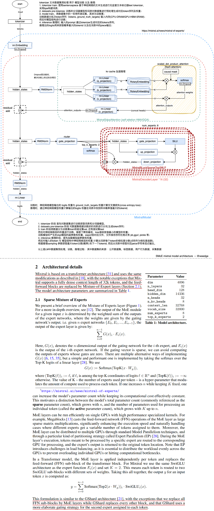

# Model
- [**Mixture of Experts Explained**](https://huggingface.co/blog/moe)
- [Mistral 7B](https://arxiv.org/pdf/2310.06825.pdf) | https://mistral.ai/news/announcing-mistral-7b/ the same as llama2 Architecture
- [**Outrageosly Large Neural Networks: The Sparsely-Gated Mixture-Of-Experts layer**](https://arxiv.org/pdf/1701.06538.pdf)
- [**A review of sparse expert models in deep learning**](https://arxiv.org/pdf/2209.01667.pdf)
- [**Mixtral of Experts**](https://arxiv.org/pdf/2401.04088.pdf) | https://mistral.ai/news/mixtral-of-experts/  the feed forward blocks are replaced by Mixture-of-Expert layers; others are the same as Mistral 7B Architecture
- [**GShard: Scaling Giant Models with Conditional Computation and Automatic Sharding**](https://arxiv.org/pdf/2006.16668.pdf) MoE(Transformer Encoder)
- [**Switch Transformers: Scaling to Trillion Parameter Models with Simple and Efficient Sparsity**](https://arxiv.org/pdf/2101.03961.pdf) (Computes auxiliary load balancing loss with gate_logits, num_experts, top_k)
- **https://github.com/mistralai/mistral-src** (just model architecture,no train)
- [HF-transformers-modeling-mistral](https://github.com/huggingface/transformers/blob/v4.37.2/src/transformers/models/mistral/modeling_mistral.py)
- [HF-transformers-modeling-mixtral](https://github.com/huggingface/transformers/blob/v4.37.2/src/transformers/models/mixtral/modeling_mixtral.py)


## Model-Architecture

```python
from transformers import AutoModelForCausalLM

def print_hf_model_for_causalLM(model_path,load_in_4bit=False):
  hf_model = AutoModelForCausalLM.from_pretrained(model_path,load_in_4bit=load_in_4bit)
  print(hf_model)
  hf_dict = hf_model.state_dict()
  print(hf_model.config)
  #print(hf_dict.keys())
```
```python
print_hf_model_for_causalLM("mistralai/Mistral-7B-v0.1")
```
```
MistralForCausalLM(
  (model): MistralModel(
    (embed_tokens): Embedding(32000, 4096)
    (layers): ModuleList(
      (0-31): 32 x MistralDecoderLayer(
        (self_attn): MistralAttention(
          (q_proj): Linear(in_features=4096, out_features=4096, bias=False)
          (k_proj): Linear(in_features=4096, out_features=1024, bias=False)
          (v_proj): Linear(in_features=4096, out_features=1024, bias=False)
          (o_proj): Linear(in_features=4096, out_features=4096, bias=False)
          (rotary_emb): MistralRotaryEmbedding()
        )
        (mlp): MistralMLP(
          (gate_proj): Linear(in_features=4096, out_features=14336, bias=False)
          (up_proj): Linear(in_features=4096, out_features=14336, bias=False)
          (down_proj): Linear(in_features=14336, out_features=4096, bias=False)
          (act_fn): SiLU()
        )
        (input_layernorm): MistralRMSNorm()
        (post_attention_layernorm): MistralRMSNorm()
      )
    )
    (norm): MistralRMSNorm()
  )
  (lm_head): Linear(in_features=4096, out_features=32000, bias=False)
)
MistralConfig {
  "_name_or_path": "mistralai/Mistral-7B-v0.1",
  "architectures": [
    "MistralForCausalLM"
  ],
  "attention_dropout": 0.0,
  "bos_token_id": 1,
  "eos_token_id": 2,
  "hidden_act": "silu",
  "hidden_size": 4096,
  "initializer_range": 0.02,
  "intermediate_size": 14336,
  "max_position_embeddings": 32768,
  "model_type": "mistral",
  "num_attention_heads": 32,
  "num_hidden_layers": 32,
  "num_key_value_heads": 8,
  "rms_norm_eps": 1e-05,
  "rope_theta": 10000.0,
  "sliding_window": 4096,
  "tie_word_embeddings": false,
  "torch_dtype": "bfloat16",
  "transformers_version": "4.37.2",
  "use_cache": true,
  "vocab_size": 32000
}

```
```python
print_hf_model_for_causalLM("mistralai/Mixtral-8x7B-v0.1")
```


```python
# hf transformers mixtral SMoE block
class MixtralSparseMoeBlock(nn.Module):
    """
    This implementation is
    strictly equivalent to standard MoE with full capacity (no
    dropped tokens). It's faster since it formulates MoE operations
    in terms of block-sparse operations to accomodate imbalanced
    assignments of tokens to experts, whereas standard MoE either
    (1) drop tokens at the cost of reduced performance or (2) set
    capacity factor to number of experts and thus waste computation
    and memory on padding.
    """

    def __init__(self, config):
        super().__init__()
        self.hidden_dim = config.hidden_size
        self.ffn_dim = config.intermediate_size
        self.num_experts = config.num_local_experts
        self.top_k = config.num_experts_per_tok

        # gating
        self.gate = nn.Linear(self.hidden_dim, self.num_experts, bias=False)

        # MixtralBLockSparseTop2MLP is FNN layer
        self.experts = nn.ModuleList([MixtralBLockSparseTop2MLP(config) for _ in range(self.num_experts)])

    def forward(self, hidden_states: torch.Tensor) -> torch.Tensor:
        """ """
        batch_size, sequence_length, hidden_dim = hidden_states.shape
        hidden_states = hidden_states.view(-1, hidden_dim)
        # router_logits: (batch * sequence_length, n_experts)
        router_logits = self.gate(hidden_states)

        routing_weights = F.softmax(router_logits, dim=1, dtype=torch.float)
        routing_weights, selected_experts = torch.topk(routing_weights, self.top_k, dim=-1)
        routing_weights /= routing_weights.sum(dim=-1, keepdim=True)
        # we cast back to the input dtype
        routing_weights = routing_weights.to(hidden_states.dtype)

        final_hidden_states = torch.zeros(
            (batch_size * sequence_length, hidden_dim), dtype=hidden_states.dtype, device=hidden_states.device
        )

        # One hot encode the selected experts to create an expert mask
        # this will be used to easily index which expert is going to be sollicitated
        expert_mask = torch.nn.functional.one_hot(selected_experts, num_classes=self.num_experts).permute(2, 1, 0)

        # Loop over all available experts in the model and perform the computation on each expert
        for expert_idx in range(self.num_experts):
            expert_layer = self.experts[expert_idx]
            idx, top_x = torch.where(expert_mask[expert_idx])

            if top_x.shape[0] == 0:
                continue

            # in torch it is faster to index using lists than torch tensors
            top_x_list = top_x.tolist()
            idx_list = idx.tolist()

            # Index the correct hidden states and compute the expert hidden state for
            # the current expert. We need to make sure to multiply the output hidden
            # states by `routing_weights` on the corresponding tokens (top-1 and top-2)
            current_state = hidden_states[None, top_x_list].reshape(-1, hidden_dim)
            current_hidden_states = expert_layer(current_state) * routing_weights[top_x_list, idx_list, None]

            # However `index_add_` only support torch tensors for indexing so we'll use
            # the `top_x` tensor here.
            final_hidden_states.index_add_(0, top_x, current_hidden_states.to(hidden_states.dtype))
        final_hidden_states = final_hidden_states.reshape(batch_size, sequence_length, hidden_dim)
        return final_hidden_states, router_logits
```

```python
# mistralai MoE layer
MoeLayer(
    experts=[FeedForward(args=args) for _ in range(args.moe.num_experts)],
    gate=nn.Linear(args.dim, args.moe.num_experts, bias=False),
    moe_args=args.moe,
)

@dataclasses.dataclass
class MoeArgs(Serializable):
    num_experts: int
    num_experts_per_tok: int

class MoeLayer(nn.Module):
    def __init__(self, experts: List[nn.Module], gate: nn.Module, moe_args: MoeArgs):
        super().__init__()
        assert len(experts) > 0
        self.experts = nn.ModuleList(experts)
        self.gate = gate
        self.args = moe_args

    def forward(self, inputs: torch.Tensor):
        gate_logits = self.gate(inputs)
        weights, selected_experts = torch.topk(gate_logits, self.args.num_experts_per_tok)
        weights = F.softmax(weights, dim=1, dtype=torch.float).to(inputs.dtype)
        results = torch.zeros_like(inputs)
        for i, expert in enumerate(self.experts):
            # torch.nonzero(condition, as_tuple=True).
            batch_idx, nth_expert = torch.where(selected_experts == i)
            results[batch_idx] += weights[batch_idx, nth_expert, None] * expert(
                inputs[batch_idx]
            )
        return results
```



# 笔记
- [makeMoE_from_Scratch](https://colab.research.google.com/drive/1o-wzk9-tTdKyG7LLEkj1y3j4g3xY6Mx0?usp=sharing)
- [mixtral-llama.cpp-inference](https://colab.research.google.com/drive/1LJtHLepg6v_BhTPZtxcyuko3DC-vUVd2?usp=sharing)